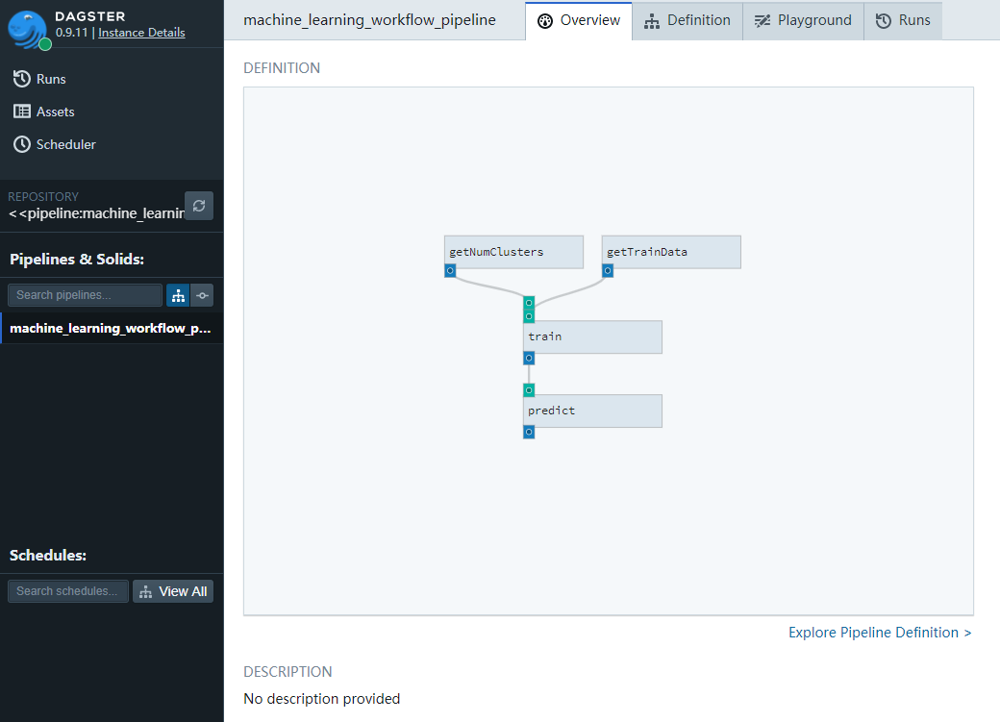
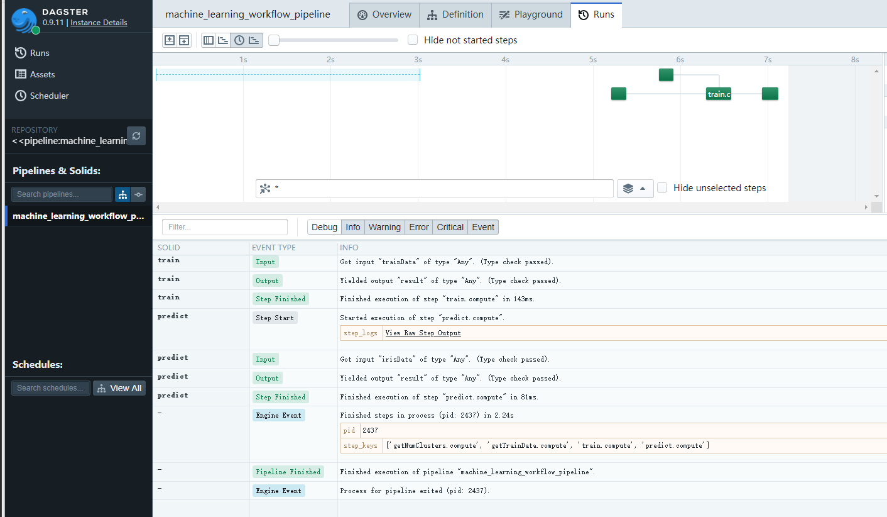

# machine_learning_workflow_on_dagster

## Purpose
For demostrating how to apply workflow to machine learning system.

## Demo





## Run

based on python 3.6.8

```
pip install -r requirement.txt

dagit -p 8080
```

open http://127.0.0.1:8080 on browser, and enter playground to run.
